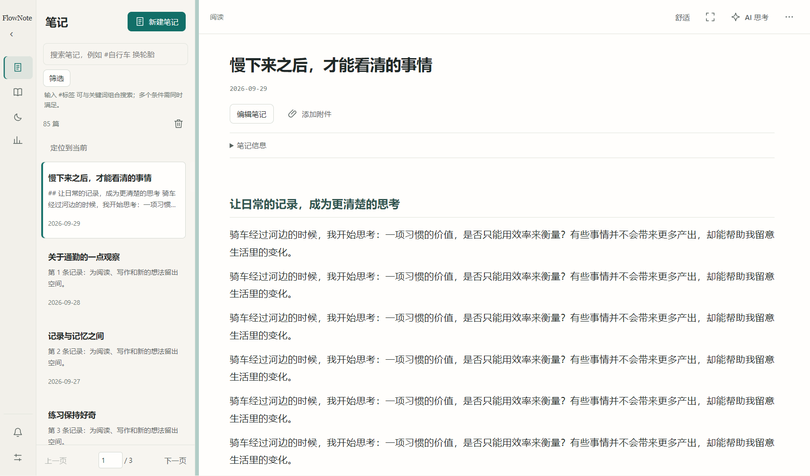
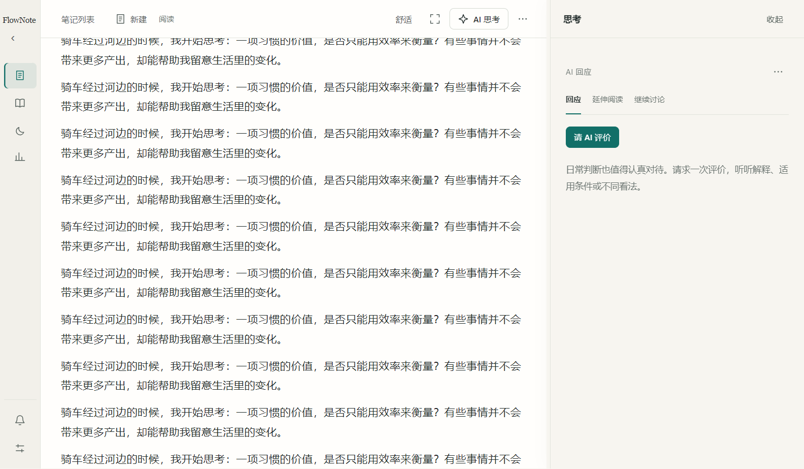
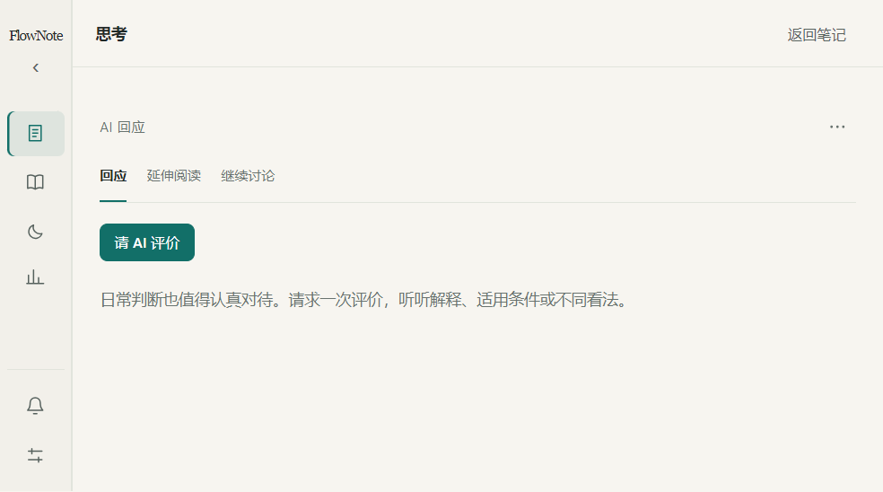

# 第二轮修订交付记录（2026-09-29）

## 当前实现

保留 Notes、Wiki、Dream 和温润纸感，完成分栏工作区及第二轮可靠性修订。代码包含前一轮尚未提交的阅读／编辑主体提取与草稿保护。

- **稳定阅读**：程序化焦点使用 `preventScroll`，外壳不承载滚动；窄窗口 AI 覆盖保留的正文；导航可收起；面板动画保持可中断。正文不做反向位移或缩放。
- **列表**：每页 30 条、页码跳转、定位当前记录、按目录记忆筛选与位置。后台更新只刷新条目内容，集合变化显示“有更新”；已删除记录失效。应用更新保留顶部锚点，重复定位使用请求编号。
- **附件**：图片和文件名可打开；按笔记归属解析附件，拒绝越界及符号链接。等待系统打开结果并反馈错误；提供文件夹定位，移除操作有确认。取消 20 个附件的显示截断。
- **结果恢复**：原始生成及搜索响应、任务、缓存存放本机，并按笔记目录隔离。单对象 JSON 解析、一次格式修复；截断 Dream 保留片段后续写。同步目录写入保留原子替换，短暂 EPERM/EBUSY 退避重试，持续错误保留待保存结果。队列最外层释放运行标志。
- **Dream**：先生成连贯的“睡眠整理”Markdown 文章并保存，再做独立外部补充。外部失败不撤销已完成文章；重试复用内部文章与成功步骤。返回 Dream 可恢复活动任务或最新报告，原笔记引用可点击。
- **延伸阅读**：最多 6 次搜索请求、24 次正文获取尝试、12 份成功资料；服务端实际搜索次数单独记录。支持 HTML、XML、文字 PDF；失败时查开放替代版本。PDF 在独立进程内解析，20 MB、80 页、20 秒限制；扫描件要求文字版。可补充本地 PDF。
- **证据**：长资料按问题选择最多 9000 字的原文片段并保留字符位置、PDF 页码；摘要不冒充全文。新书籍推荐必须有原文支持的评分或专业书评；不同平台不混算，未知来源不再默认归为可靠二手资料。
- **旧模块**：目标、成果、主题知识库的专用页面、接口、类型、存储与测试已移除。独立旧数据导出保留。清理工具仅显式操作指定目录，不随应用启动或目录切换自动执行。

## 验证记录

| 检查 | 结果与证据 |
|---|---|
| 类型检查、构建 | 通过 |
| 单元／组件测试 | 57 项通过；旧模块专用测试随功能删除 |
| 真实开发版流程 | 离线新建保存、混合历史编号、筛选定位、分类、评论、追问、接纳更新 Wiki、Dream、重启恢复通过；模型响应使用明确标识的隔离模拟样本 |
| 真实 Electron 布局 | 800×500、1280×800、1440×900、1920×1080，分隔条、专注、草稿、追问草稿、减少动态效果、快速反向操作通过 |
| 动效连续帧 | 工作区 `scrollLeft` 始终为 0；采样中正文位置无先越界再回弹；见 evidence-round2 中 frames JSON 与 motion 截图 |
| 分页刷新 | 第二页滚动后新增笔记不改变页码和滚动；定位回当前记录通过 |
| 存储故障注入 | 临时 EPERM 重试成功；持续 EACCES 保留结果且不无限重试；JSON 尾随说明可解析，多个对象／截断拒绝；外部研究失败保留 Dream 内部文章 |
| PDF 独立进程 | 文字与页码提取通过，无文字文件明确返回需要文字版 |
| 公开互联网样本 | arXiv 1706.03762 摘要页、15 页 PDF 均取得文本；PDF 提取 41864 字。仅为获取能力样本，不证明任意网站都可读取 |
| 旧模块备份 | 当前目录共 3 个文件，原始字节及 SHA-256 逐文件复核后清理；隔离样本验证可还原、幂等执行、其他目录保持不变 |

公开样本：[摘要页](https://arxiv.org/abs/1706.03762)、[论文 PDF](https://arxiv.org/pdf/1706.03762)。

可重复执行：`npm run typecheck`、`npm run test:run`、`npm run build`；随后运行 `scripts/verify-workspace.mjs`、`scripts/verify-thinking.mjs`、`scripts/verify-pdf.mjs`、`scripts/verify-public-sources.mjs`。最后一个脚本访问公开互联网，其余使用隔离数据，不改用户笔记。

## 数据与备份

实际旧数据备份位置：`C:\Users\12461\AppData\Local\FlowNote\legacy-backups\2026-09-29`。

`manifest.json` 记录原始相对路径、字节数、SHA-256；`files` 保存原始字节；`completed.json` 记录清理完成。还原时按清单将文件复制回对应目录，先核对哈希，不覆盖已有新文件。清理工具为 `scripts/retire-modules.mjs`，默认仅预览；必须显式传 `--execute` 才执行备份与清理。

任务本机数据位于 `%LOCALAPPDATA%\FlowNote\research\<目录哈希>`。`FLOWNOTE_LOCAL_DATA` 可为测试指定隔离根目录。最终文章、证据与反馈仍在笔记目录；旧 Dream Markdown 继续可读。

## 使用及验收边界

1. 可运行 `npm run dev` 试用。后台更新不会直接把新笔记插入正在浏览的列表，点击“有更新”应用；“定位到当前”用于找回正在阅读的笔记。
2. 书目推荐变少可能是质量门槛未取得依据，而非读取失败。研究过程显示读取状态；来源对观点是否适用仍需实际阅读判断。
3. 本轮未用真实付费模型批量比较新旧 Dream 的主观质量。反思是否带来新认识，仍需产品经理用真实笔记验收，不能把模拟流程通过当作质量通过。
4. 系统默认应用打开已实现并有成功／缺失／无关联程序测试；实际 Windows 图片浏览器与编辑器的呈现需在用户机器上试用确认，不修改文件关联。
5. 动效包含真实 Electron 连续帧与位置检查，尚不等同于用户对实际显示器流畅度、文字清晰度的人工验收。
6. OpenAlex 保持可选：仅显式设置 `FLOWNOTE_OPENALEX_KEY` 时，为取得的 `content.openalex.org` 下载链接附加密钥；未配置走公开来源，不自动开通任何服务。该可选密钥路径未做带密钥实测。[官方全文说明](https://help.openalex.org/access/fulltext/)
7. 未确认远端是否完成的中断请求会提示可能再次计费；只保证复用已持久化的成功步骤，不承诺所有重试都免费。
8. PDF 页数／字数限制与相关片段选取意味着报告不是全文逐字审读。扫描 OCR、登录及付费墙绕过、Sci-Hub 均未引入。

## 界面与运动证据

动效采样文件：`motion-0.png`、`motion-80.png`、`motion-160.png`、`motion-240.png`；数值轨迹为 `frames-800.json`、`frames-1280.json`、`frames-1920.json`。所有画面使用合成笔记，不包含真实私人笔记。
